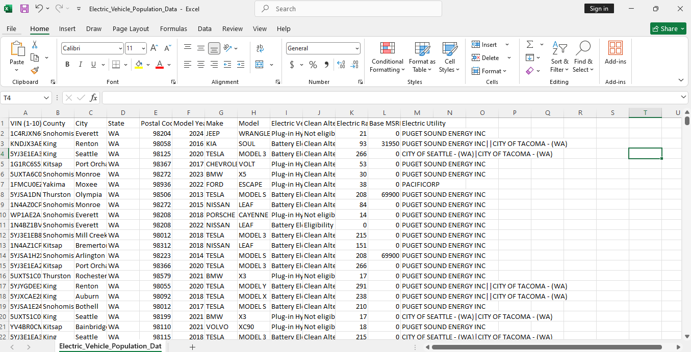

## Electric Vehicle SQL Analysis

### Project Overview 

## Objectives
### EV Distribution:
- List the total number of electric vehicles for each state and each county.
- Determine all electric vehicles located in the city of Seattle.

### MSRP Comparison:
- Find all electric vehicles with a Base MSRP greater than the average MSRP of all vehicles in the electric vehicle population.

### Plug-in Hybrid Analysis:
- List all Plug-in Hybrid Electric Vehicles (PHEV) from King County with an electric range greater than 50 miles.

### High-Concentration Cities:
- Count the number of electric vehicles in each city, but only include cities with more than 100 vehicles.

### Long-Range Vehicles by County:
- List the Make and Model of electric vehicles located in counties where the average electric range exceeds 150 miles.

### Vehicle Categorization according to Base MSRP
- Categorize vehicles as either "Affordable" (Base MSRP ≤ $40,000) or "Expensive" (Base MSRP > $40,000) and find the total number of vehicles in each category.

### Electric Range Ranking:
- Display the Make, Model, and Electric Range of each vehicle along with its rank based on the electric range within its county (highest range first).

### Clean Alternative Fuel Vehicle (CAFV) Analysis with CTEs:
- Calculate the total number of electric vehicles and CAFV-eligible vehicles for each state and
compute the percentage of CAFV-eligible vehicles for each state.

## About the Data
The dataset contains information about population of electric vehicle in the United States of America includig details like vehicle characteristics, pricing and various dimensions.



Nubmer of entries - 194232

Number of columns - 13

**Columns used for the analysis**

VIN - 

county -

city -

state -

postal_code -

model_year -

make -

model -

electric_vehicle_type -

clean_alternative_fuel_vehicle_CAFV -

electric_range -

base_msr -

electric_utility - 

### Tools
- PostgreSQL

- pgAdmin 4 for PostgresSQL

- Power Bi for visualization

## Data Cleaning

### Queries
**EV Distribution:**

Total number of electric vehicles for each state.
```
select state, count(*) as Total_no_of_ev
from ev_sales_table
group by state
```


Total number of electric vehicles for  each county.
```
select county, count(*) as Total_no_of_ev
from ev_sales_table
group by county
order by Total_no_of_ev desc
```


All electric vehicles located in the city of Seattle
```
select count(*) as Total_no_of_ev
from ev_sales_table
where city = 'Seattle'
```


**MSRP Comparison:**

Find all electric vehicles with a Base MSRP greater than the average MSRP of all vehicles in the electric vehicle population.
```
select "VIN (1-10)", base_msr
from ev_sales_table
where base_msr > (select avg(base_msr) from ev_sales_table)
```


**Plug-in Hybrid Analysis**

List all Plug-in Hybrid Electric Vehicles (PHEV) from King County with an electric range greater than 50 miles.
```
select * 
from ev_sales_table
where county = 'King' and electric_vehicle_type = 'Plug-in Hybrid Electric Vehicle (PHEV)'
and electric_range > 50 
```


**High-Concentration Cities**

Count the number of electric vehicles in each city, but only include cities with more than 100 vehicles.
```
select city, count(*) as total_ev
from ev_sales_table
group by city
having count(*) > 100
```


**Long-Range Vehicles by County**

List the Make and Model of electric vehicles located in counties where the average electric range exceeds 150 miles.
```
select "VIN (1-10)", make, model
from ev_sales_table
where county in
	(select county from ev_sales_table
	group by county
	having avg(electric_range) > 150)
```


**Vehicle Categorization according to Base MSRP**

Categorize vehicles as either "Affordable" (Base MSRP ≤ $40,000) or "Expensive" (Base MSRP > $40,000) and find the total number of vehicles in each category.
```
select
	case 
		when base_msr <= 40000 then 'Affordable' 
		when base_msr > 40000 then 'Expensive'
		else 'Not Available'
	end as ev_cost_category,
	count(*) as total_no_of_ev
from ev_sales_table
group by ev_cost_category
```


**Electric Range Ranking**

Display the Make, Model, and Electric Range of each vehicle along with its rank based on the electric range within its county (highest range first).
```
select county, make, model, electric_range,
rank () over (partition by county order by electric_range desc) as rank_within_county
from ev_sales_table
```


**Clean Alternative Fuel Vehicle (CAFV) Analysis with CTEs**

Calculate the total number of electric vehicles and CAFV-eligible vehicles for each state and
compute the percentage of CAFV-eligible vehicles for each state.
```
with vehicle_count as (
	select 
		state,
		count(*) as total_no_ev,
		sum(case when clean_alternative_fuel_vehicle_CAFV = 'Clean Alternative Fuel Vehicle Eligible' then 1 else 0 end ) as total_no_CAFV 
	from ev_sales_table
	group by state
)
select *, (total_no_cafv::float /total_no_ev)*100 as perc_of_cafv
from vehicle_count
```


### Data Visualization


## Findings
